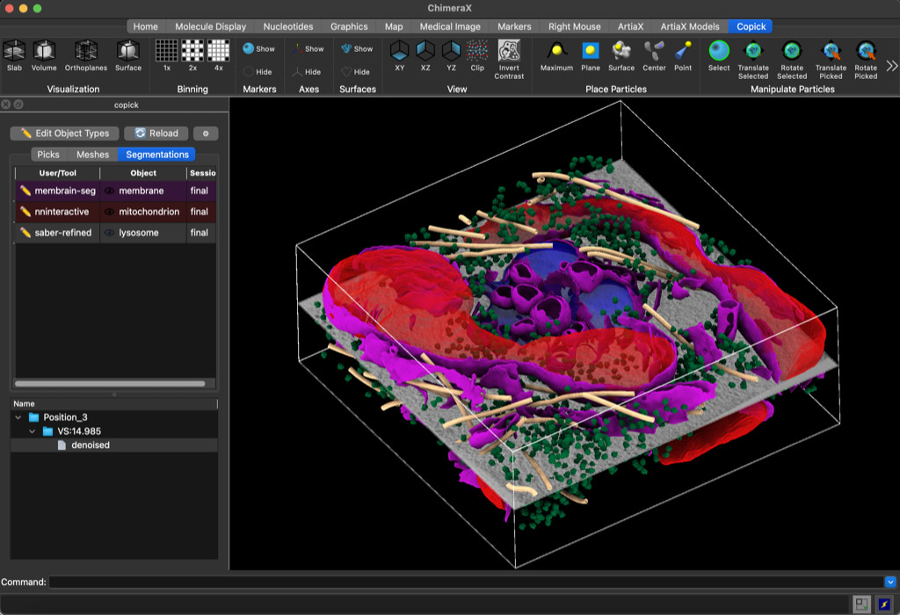

# chimerax-copick

<p align="center">
  
</p>

A collaborative cryo-ET annotation plugin for [ChimeraX](https://www.cgl.ucsf.edu/chimerax/).

Browse runs in a thumbnail gallery, load tomograms at any resolution, and create and edit
particle picks, meshes, and segmentations — all stored in a portable
[copick](https://copick.github.io/copick/) project that works against local files,
S3/SSH/SMB storage, or the [CZ cryoET Data Portal](https://cryoetdataportal.czscience.com/).
Picking and 3D visualization are powered by [ArtiaX](https://github.com/FrangakisLab/ArtiaX);
volumes stream as multiscale OME-Zarr.

## Installation

Install from the ChimeraX Toolshed: **Tools → More Tools…**, search for **copick**, click
**Install**, and restart ChimeraX if prompted.

Requires ChimeraX ≥ 1.7. [ArtiaX](https://github.com/FrangakisLab/ArtiaX),
[ChimeraX-OME-Zarr](https://github.com/uermel/chimerax-ome-zarr), and
[copick](https://copick.github.io/copick/) are pulled in automatically.

To create or import projects from the command line (below), also install the copick CLI in
your terminal environment:

```shell
pip install "copick[all]"
```

## Quick start

A copick project is described by a small JSON **config file**. Point ChimeraX at one with
`copick start /path/to/config.json`. Two ways to get a config in a couple of minutes:

**From the CZ cryoET Data Portal** (no downloads — objects and existing annotations are
discovered automatically):

```shell
copick config dataportal --dataset-id 10301 --overlay ./overlay --output config.json
```

**From your own MRC tomograms** (local project):

```shell
# Create a local project and declare the objects you'll annotate
copick config filesystem \
    --config config.json \
    --overlay-root ./my_project \
    --objects ribosome,True,150,7P6Z --objects membrane,False \
    --proj-name my-project --proj-description "My cryo-ET dataset"

# Import tomograms (file type and voxel size are read from the MRC header)
copick add tomogram "tomograms/*.mrc" --config config.json --tomo-type wbp
```

Then, in the ChimeraX command line:

```
copick start config.json
```

Run `cks` to enable copick keyboard shortcuts, then press `?` for the full list.

## Documentation

- copick docs: <https://copick.github.io/copick/>
- ChimeraX-copick tutorial: <https://copick.github.io/copick/examples/tutorials/chimerax/>
- Quick start: <https://copick.github.io/copick/quickstart/>

## OpenMoji attribution

Emoji glyphs on Linux are rendered with the bundled [OpenMoji](https://openmoji.org) color
font. All emojis are designed by [OpenMoji](https://openmoji.org) and licensed under
[Creative Commons Attribution-ShareAlike 4.0 International (CC BY-SA 4.0)](https://creativecommons.org/licenses/by-sa/4.0/).
The full license text ships with the plugin at
[`src/fonts/OpenMoji-LICENSE.txt`](src/fonts/OpenMoji-LICENSE.txt).

## License

MIT — see [LICENSE](LICENSE).
