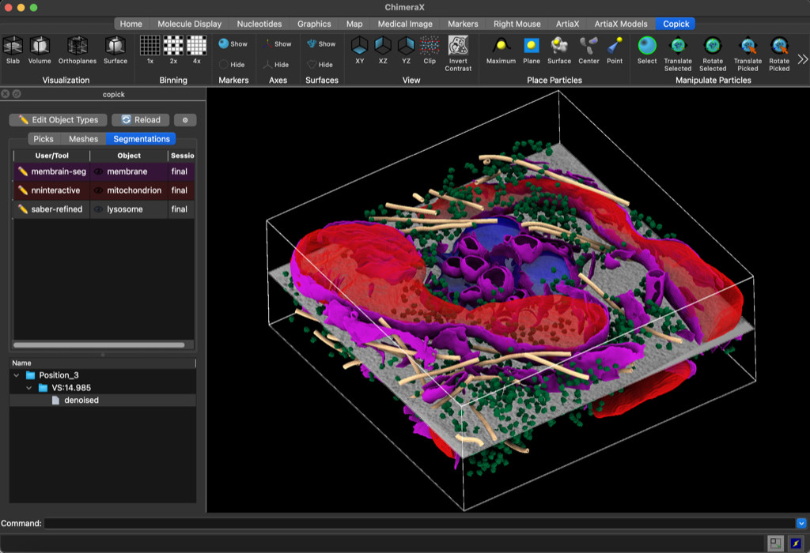

# chimerax-copick

<p align="center">
  
</p>

A collaborative cryo-ET annotation plugin for [ChimeraX](https://www.cgl.ucsf.edu/chimerax/).

Browse runs in a thumbnail gallery, load tomograms at any resolution, and create and edit
particle picks, meshes, and segmentations — all stored in a portable
[copick](https://copick.github.io/copick/) project that works against local files,
S3/SSH/SMB storage, or the [CZ cryoET Data Portal](https://cryoetdataportal.czscience.com/).
Picking and 3D visualization are powered by [ArtiaX](https://github.com/FrangakisLab/ArtiaX);
volumes stream as multiscale OME-Zarr.

## 2.0 alpha installation

The `v2.0` line is currently an alpha and is not published to the public ChimeraX Toolshed. It requires ChimeraX
Daily 1.13 from 2026-08-17 or newer (Core `>=1.13.dev202608172052`) with embedded Python 3.14.

The initial integration stack is deliberately fixed to:

- `copick==2.0.0a1`;
- `copick-shared-ui==2.0.0a1`;
- `ChimeraX-OME-Zarr==1.0.0a1`; and
- Zarr 3.1.6 for the minimum-stack run, plus Zarr 3.3.0 as the maintained endpoint.

Download `chimerax_ome_zarr-1.0.0a1-py3-none-any.whl` from the
[ChimeraX-OME-Zarr v1.0.0-alpha.1 release](https://github.com/uermel/chimerax-ome-zarr/releases/tag/v1.0.0-alpha.1)
and verify its SHA-256 is
`fd9f0c49505237d200c65afafb24a088ee1f7eb8f8ab29e84991a358354684b0`. Download the selected
`2.0.0-alpha.N` chimerax-copick wheel and its `.sha256` file from the matching
[GitHub prerelease](https://github.com/copick/chimerax-copick/releases), then verify that checksum as well.

In a clean ChimeraX Daily profile, install the exact Python alphas and then the two bundle wheels:

```text
devel pip install "copick[all]==2.0.0a1" "copick-shared-ui==2.0.0a1" "zarr==3.1.6"
toolshed install /absolute/path/chimerax_ome_zarr-1.0.0a1-py3-none-any.whl
toolshed install /absolute/path/ChimeraX_copick-2.0.0aN-py3-none-any.whl
```

The shared-UI PyPI wheel SHA-256 for this stack is
`c56d06ee53cffc7cda56a916d480793198e2311b099e7965c132ea27e43f6515`. See the
[alpha release runbook](docs/release-alpha.md) for the build, evidence, and rollback procedure. Do not substitute
an unqualified install command for these alpha instructions.

## Storage compatibility

ChimeraX-copick 2.0 reads existing OME-Zarr 0.4 / Zarr v2 projects and OME-Zarr 0.5 / Zarr v3 projects. Newly
created or rebuilt volume stores use OME-Zarr 0.5 / Zarr v3 through copick 2.0; opening a legacy project does not
convert or rewrite its existing stores. Pyramid arrays are selected from OME metadata, so their paths do not need
to be numeric. Chunk sizes, shard grids, key encodings, and codecs are input properties interpreted by
ChimeraX-OME-Zarr, not fixed application requirements.

To create or import projects from the command line (below), also install the copick CLI in
your terminal environment:

```shell
pip install --pre "copick[all]==2.0.0a1"
```

## Quick start

A copick project is described by a small JSON **config file**. Point ChimeraX at one with
`copick start /path/to/config.json`. Two ways to get a config in a couple of minutes:

**From the CZ cryoET Data Portal** (no downloads — objects and existing annotations are
discovered automatically):

```shell
copick config dataportal --dataset-id 10301 --overlay ./overlay --output config.json
```

**From your own MRC tomograms** (local project):

```shell
# Create a local project and declare the objects you'll annotate
copick config filesystem \
    --config config.json \
    --overlay-root ./my_project \
    --objects ribosome,True,150,7P6Z --objects membrane,False \
    --proj-name my-project --proj-description "My cryo-ET dataset"

# Import tomograms (file type and voxel size are read from the MRC header)
copick add tomogram "tomograms/*.mrc" --config config.json --tomo-type wbp
```

Then, in the ChimeraX command line:

```
copick start config.json
```

Run `cks` to enable copick keyboard shortcuts, then press `?` for the full list.

## Documentation

- copick docs: <https://copick.github.io/copick/>
- ChimeraX-copick tutorial: <https://copick.github.io/copick/examples/tutorials/chimerax/>
- Quick start: <https://copick.github.io/copick/quickstart/>

## OpenMoji attribution

Emoji glyphs on Linux are rendered with the bundled [OpenMoji](https://openmoji.org) color
font. All emojis are designed by [OpenMoji](https://openmoji.org) and licensed under
[Creative Commons Attribution-ShareAlike 4.0 International (CC BY-SA 4.0)](https://creativecommons.org/licenses/by-sa/4.0/).
The full license text ships with the plugin at
[`src/fonts/OpenMoji-LICENSE.txt`](src/fonts/OpenMoji-LICENSE.txt).

## License

MIT — see [LICENSE](LICENSE).
